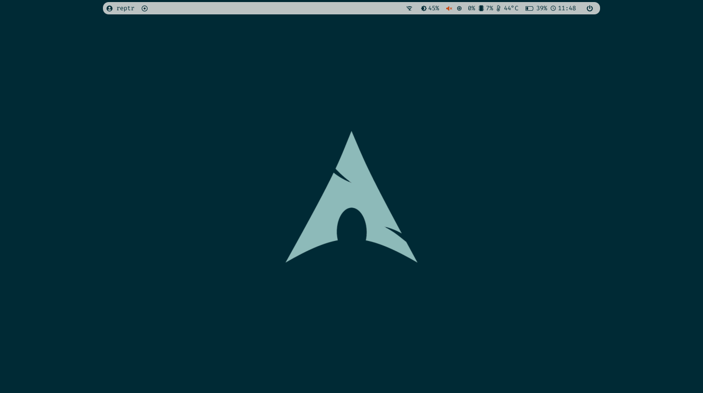
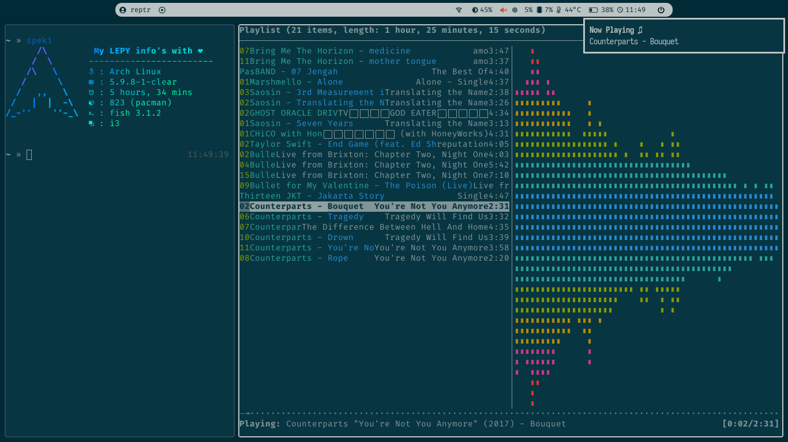
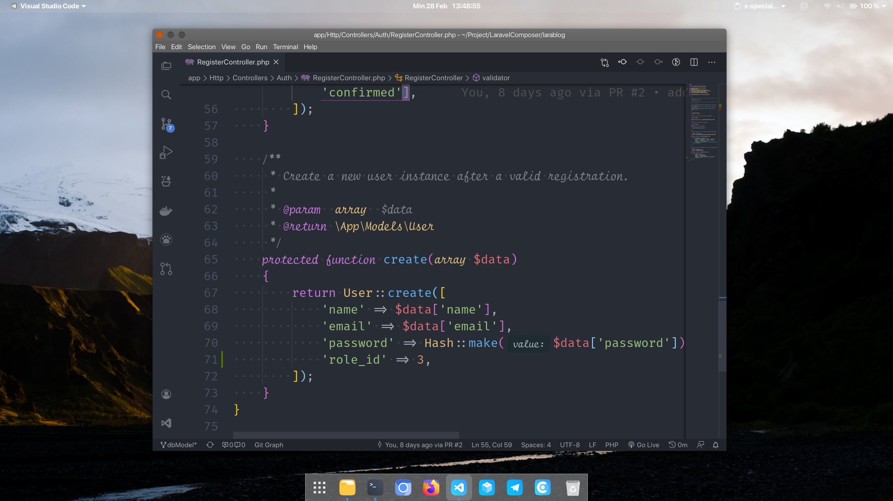

# dotfiles

## Daftar Isi

- [dotfiles](#dotfiles)
  - [Daftar Isi](#daftar-isi)
  - [About](#about)
  - [Details](#details)
  - [Screenshoot](#screenshoot)
    - [i3WM](#i3wm)
    - [Gnome](#gnome)

## About

This is my *dotfile* for customization linux.

 

## Details

| i3WM                  |                                                 |
| :-------------------- | :---------------------------------------------- |
| OS                    | ArchLinux                                       |
| WM                    | I3-gaps, i3-gaps-rounded                        |
| Shell                 | fish _([fish](https://github.com/fish))_        |
| DM                    | Slim                                            |
| Font                  | Fira Code, Fira Code Nerd Font                  |
| Compositor            | Compton                                         |
| Notification          | Dunst                                           |
| Terminal              | URxvt                                           |
| Launcher              | rofi, dmenu, j4-dmenu-desktop                   |
| Bar                   | polybar                                         |
| Wallpaper             | feh                                             |
| Lock Screen           | i3lock                                          |
| Logout / Shutdown     | script                                          |

| Gnome                  |                                                 |
| :-------------------- | :---------------------------------------------- |
| OS                    | ArchLinux                                       |
| DE                    | Gnome                                           |
| WM                    | Mutter                                          |
| Shell                 | fish _([fish](https://github.com/fish))_        |
| Font                  | SF Pro Display                                  |
| Terminal              | Gnome Terminal                                  |
| Gnome Extension       | Clipboard Indicator, Dash to Dock, Dynamic Panel Transparency, Hide Activities Button, Hide Top Bar, Lock Keys, Panel OSD, VirtualBox applet                      |

 

## Screenshoot

### i3WM

* Homescreen

* Neofetch & NCMPCPP

### Gnome

* Homescreen

* Nautilus & Neofetch

* VS Code
