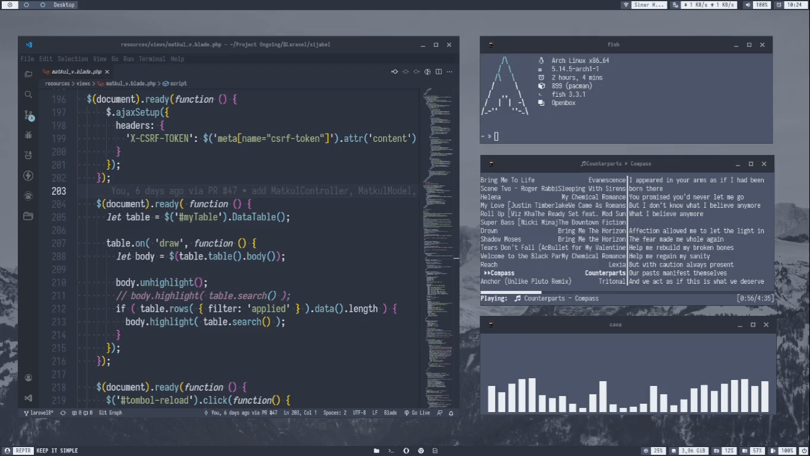
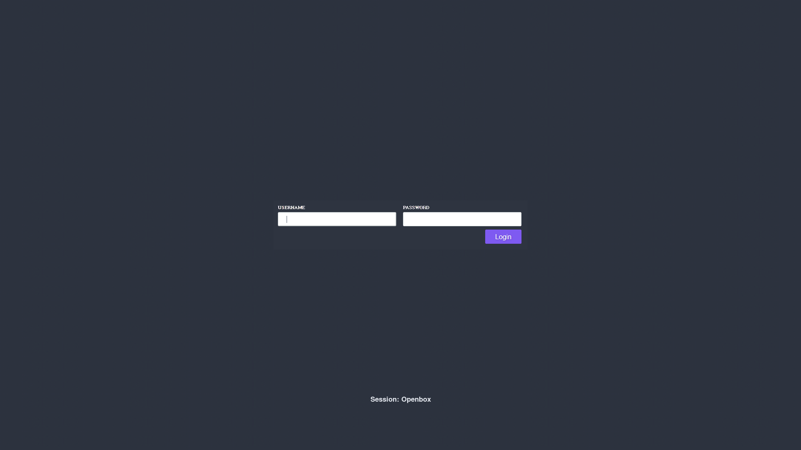
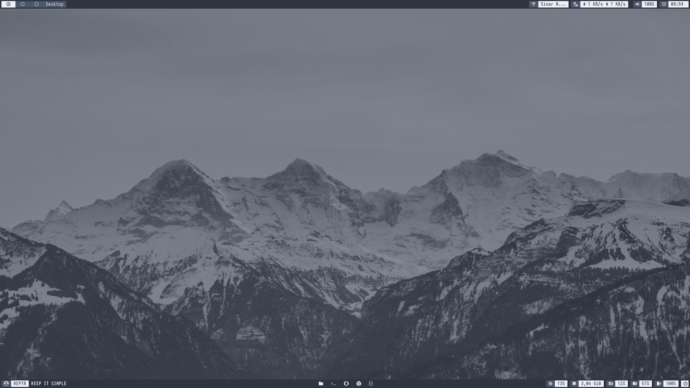
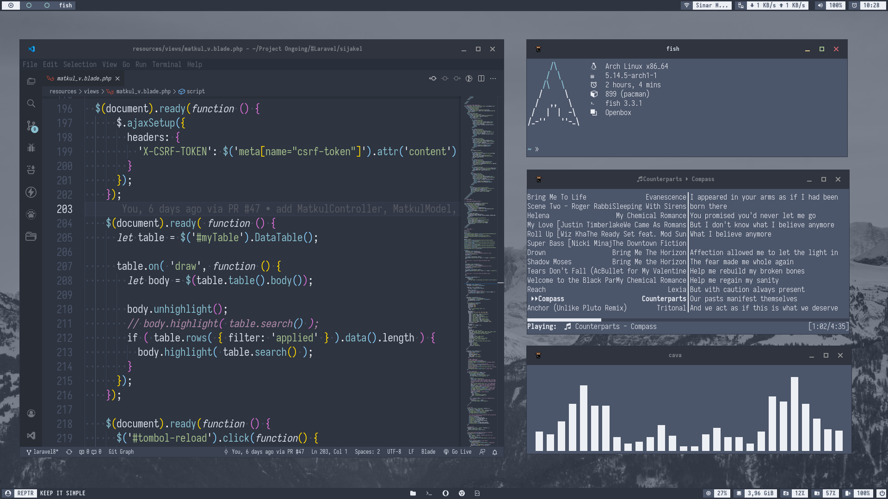
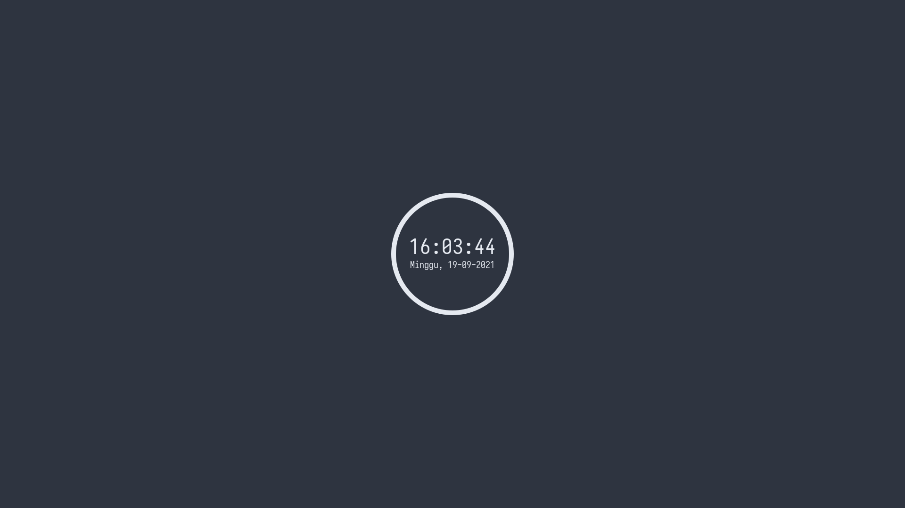

# ~/.dotfiles



<p align="center">
<a href='#license'></a>
<a href='#stars'></a>
<a href='#size'></a>

<br />
<p align="justify"><b>
This a repository with my personal configuration files. This repository serves as my way to help myself set up and maintain my workspaces. Managed using GNU stow.
I hope you understand everything here.
</b></p>

<br />

## Preview
</details>

 <details close>
 <summary><strong>Show</strong></summary>
  <br>
  
  <p align="center">Login Screen</p>
  
  <br>
  
  <p align="center">Desktop</p>

  <br />
  
  <p align="center">Workspace</p>

  <br />
  
  <p align="center">Lock Screen</p>
</details>

<br />

## Details
</details>

 <details close>
 <summary><strong>Show</strong></summary>
   <br>

| Info                  | Description          |
| --------------------- | -------------------- |
| `Operating System`    | Arch Linux           |
| `WM`                  | Openbox              |
| `Desktop Environment` | none                 |
| `Shell`               | fish, bash           |
| `Font`                | Iosevka nerd font    |
| `Bar`                 | polybar              |
| `Display Server`      | X11                  |
| `Display Manager`     | slim                 |
| `Brightness Manager`  | xbacklight           |
| `Network Manager`     | networkmanager-dmenu |
| `Audio Manager`       | alsa, pulseaudio     |
| `Clipboard Manager `  | clipmenu             |
| `Launcher`            | rofi                 |
| `Notification`        | dunst                |
| `Terminal`            | kitty                |
| `Text Editor`         | VS Code, nano        |
| `File Manager `       | thunar               |
| `Music Player`        | mpd + ncmpcpp        |
| `Lock Screen`         | i3lock-color         |
| `Logout/Shutdown`     | script + rofi        |

</details>
<br />

## Keybinds

</details>

 <details close>
 <summary><strong>Show</strong></summary>
   <br>

| Keybinds                     | Description                                                  |
| ---------------------------- | ------------------------------------------------------------ |
| `Super + d`                  | launch Rofi with wrapper script                              |
| `Super + Space`              | launch root menu (like right click on the desktop)           |
| `Alt + Tab`                  | switch to next window                                        |
| `Alt + Shift + Tab `         | switch to previous window                                    |
| `Super + Ctrl + Left/Right`  | switch to previous/next workspace                            |
| `Super + 1-3`                | switch to workspace 1-3                                      |
| `Super + Shift + 1-3`        | take the current active window to workspace 1-3              |
| `Super + Shift + Left/Right` | take the current active window to prev/next workspace        |
| `Super + q`                  | close                                                        |
| `Super + p`                  | launch Clipmenu                                              |
| `Super + enter`              | launch kitty terminal                                        |
| `Super + Shift + p`          | reset Clipmenu                                               |
| `Super + r `                 | reload, do this after modify the openbox configuration files |
| `Double Click Titlebar`      | maximize                                                     |

` ...More keybinds just read the .config/openbox/rc.xml`

</details>

<br />


## How I Restore My Setup with GNU Stow
>Notes : If you want to use this configuration, inspect the code before use.
>Just cherry-pick what you want to keep your system clean.

Clone this repository in ~/.dotfiles directory, e.g.:

```bash
$ git clone --recursive https://github.com/restuhanputra/dotfiles ~/.dotfiles
```
Use stow to manage symlinks, e.g. i wanna symlinks openbox configuration:
```bash
$ cd ~/.dotfiles
$ stow -v -R -t ~/.config .config/openbox
```
to unsymlinks, e.g:
```bash
$ stow -v -D -t ~/.config .config/openbox
```
<br />

## Here is my old dotfile, feel free to check it out:
- [i3WM Dotfile](https://github.com/restuhanputra/dotfiles/tree/i3wm)
- [Gnome Dotfile](https://github.com/restuhanputra/dotfiles/tree/gnome)
- [KDE Dotfile](https://github.com/restuhanputra/dotfiles/tree/kde)

<br />

## License
Released and source is available under [MIT License](LICENSE)