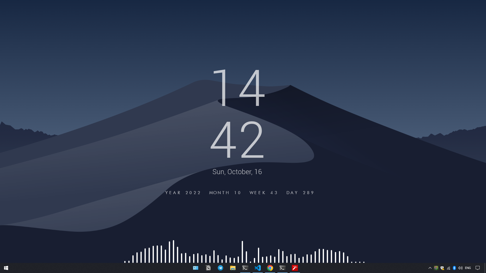
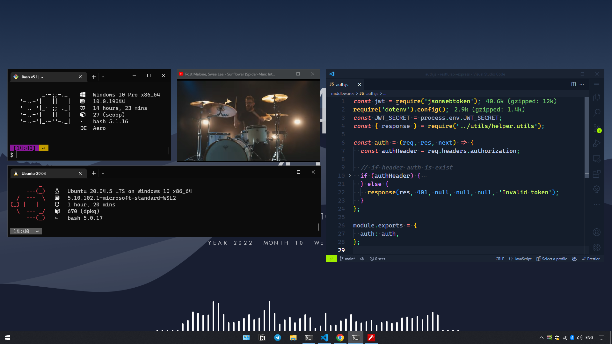

# ~/.dotfiles


<p align="center">
<a href='#license'></a>
<a href='#stars'></a>
</p>

<br />
<p align="justify">
This a repository with my personal configuration files. This repository serves as my way to help myself set up and maintain my workspaces. Managed using mklink. I hope you understand everything here.
</p>

<br />

## Preview

</details>

 <details close>
 <summary><strong>Show</strong></summary>
  
  <p align="center">Desktop</p>

  <br />
  
  <p align="center">Workspace</p>
</details>

<br />

## Details

</details>

 <details close>
 <summary><strong>Show</strong></summary>
   <br>

| Info               | Description                      |
| ------------------ | -------------------------------- |
| `Operating System` | [windows 10](https://www.microsoft.com/en-id/windows/windows-10-specifications)                       |
| `Shell`            | [git bash](https://git-scm.com/), [powershell](https://learn.microsoft.com/en-us/powershell/) |
| `Terminal`         | [windows terminal](https://www.microsoft.com/store/apps/9n0dx20hk701)                 |
| `Cursor`         |    [macOS monterey white](https://www.gnome-look.org/p/1648129) |
| `Font`             | [caskaydia cove nerd font](https://github.com/ryanoasis/nerd-fonts/releases/download/v2.2.2/CascadiaCode.zip), [cascadia code](https://github.com/microsoft/cascadia-code)    |
| `Text Editor`      | [vs code](https://code.visualstudio.com/)                          |
| `Package Manager`  | [scoop](https://scoop.sh/)                            |
| `Git Commit`       | [git semantic commit](https://github.com/fteem/git-semantic-commits)              |
| `Dekstop Widget`   | [rainmeter](https://www.rainmeter.net/)                        |
| `WSL2 Distro`      | [ubuntu 20.04](https://ubuntu.com/wsl)                     |

</details>
<br />

## How I Restore My Setup with mklink

> Notes : If you want to use this configuration, inspect the code before use.
> Just cherry-pick what you want to keep your system clean.

Clone this repository in ~/dotfiles directory, e.g.:

```cmd
git clone --recursive https://github.com/restuhanputra/dotfiles ~/dotfiles
```

Use mklink to manage symlinks (use command prompt with administrator privileges), e.g. i wanna symlinks neofetch configuration:

```cmd
 cd ~/dotfiles

 mklink /D ".config\neofetch" "dotfiles\config\neofetch"
```

to unsymlinks, just delete the file symlinks. not the original one, e.g:

```cmd
rm .config\neofetch
```

<br />

## Here is my old dotfile, feel free to check it out:

- [Openbox Dotfile](https://github.com/restuhanputra/dotfiles/tree/openbox)
- [i3WM Dotfile](https://github.com/restuhanputra/dotfiles/tree/i3wm)
- [Gnome Dotfile](https://github.com/restuhanputra/dotfiles/tree/gnome)
- [KDE Dotfile](https://github.com/restuhanputra/dotfiles/tree/kde)

<br />

## License

Released and source is available under [MIT License](LICENSE)
