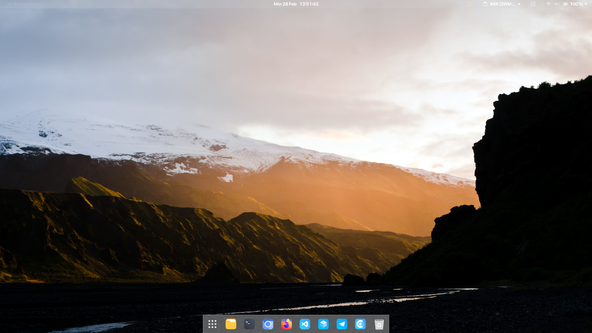
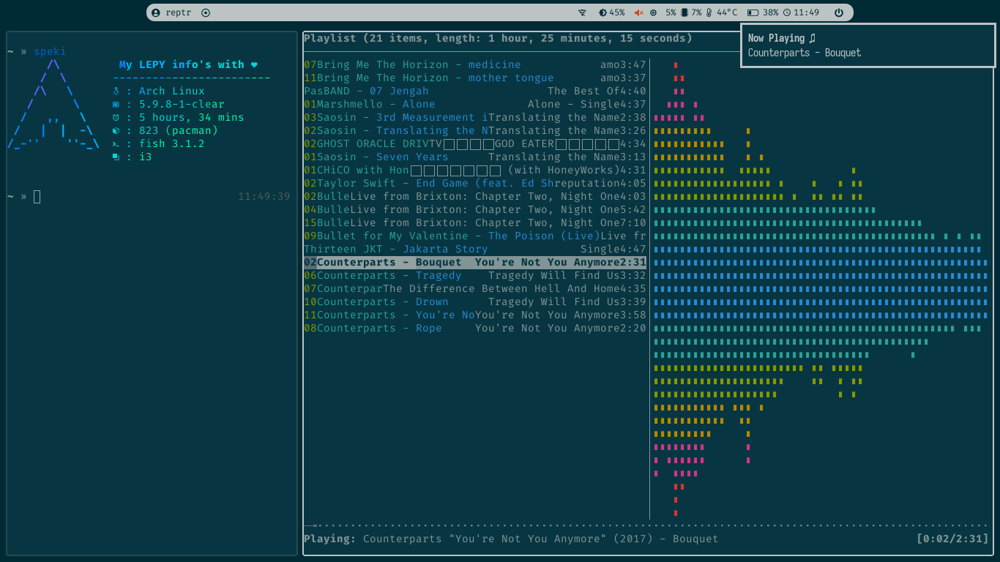

# ~/.dotfiles

## Table of Content

  - [About](#about)
  - [Information](#information)
  - [Screenshoot](#screenshoot)

## About
Hi there! Thanks for visiting!
 
This is my personal configuration for customization i3wm and some applications too.

I hope you understand everything here. :wink:

 

## Information

| #                 | Details                                                                                                                                                |
| :---------------- | :----------------------------------------------------------------------------------------------------------------------------------------------------- |
| OS                | [Arch Linux](https://archlinux.org/)                                                                                                                   |
| WM                | [i3-gaps](https://archlinux.org/packages/?name=i3-gaps), [i3-gaps-rounded](https://aur.archlinux.org/packages/i3-gaps-rounded-git/)                    |
| Shell             | [fish](https://github.com/fish)                                                                                                                        |
| DM                | [Slim](https://archlinux.org/packages/?name=slim)                                                                                                      |
| Font              | Fira Code, Fira Code Nerd Font                                                                                                                         |
| Compositor        | Compton                                                                                                                                                |
| Notification      | Dunst                                                                                                                                                  |
| Terminal          | [URxvt](https://wiki.archlinux.org/title/rxvt-unicode)                                                                                                 |
| Launcher          | [rofi](https://github.com/davatorium/rofi), [dmenu](https://tools.suckless.org/dmenu/), [j4-dmenu-desktop](https://github.com/enkore/j4-dmenu-desktop) |
| Bar               | [polybar](https://github.com/polybar/polybar)                                                                                                          |
| Wallpaper         | [feh](https://github.com/derf/feh)                                                                                                                     |
| Lock Screen       | [i3lock](https://github.com/i3/i3lock)                                                                                                                 |
| Logout / Shutdown | script                                                                                                                                                 |

 

## Screenshoot

* Homescreen

* Neofetch & NCMPCPP
