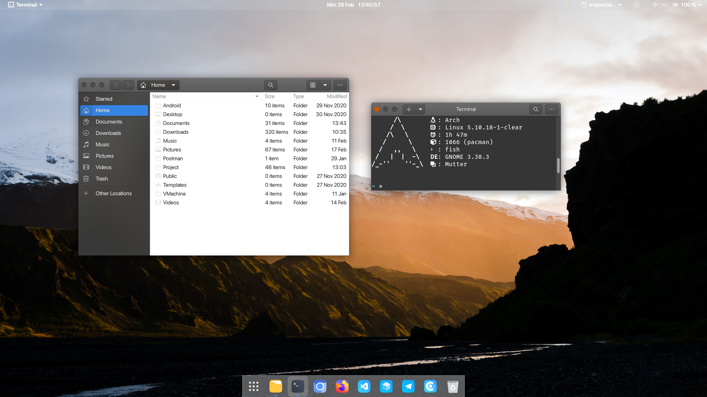
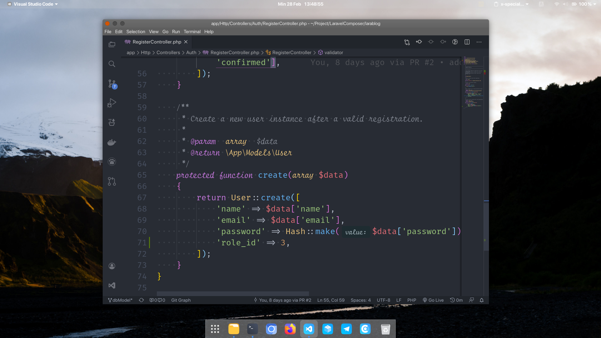

# ~/.dotfiles

## Table of Content

  - [About](#about)
  - [Information](#information)
  - [Screenshoot](#screenshoot)

## About
Hi there! Thanks for visiting!
 
This is my personal configuration for customization gnome and some applications too.

I hope you understand everything here. :wink:

 

## Information

| #               | Details                                                                                                                                                                                                                                                                                                                                                                                                                                                                                                                                                                                                                                                                     |
| :-------------- | :-------------------------------------------------------------------------------------------------------------------------------------------------------------------------------------------------------------------------------------------------------------------------------------------------------------------------------------------------------------------------------------------------------------------------------------------------------------------------------------------------------------------------------------------------------------------------------------------------------------------------------------------------------------------------- |
| OS              | [Arch Linux](https://archlinux.org/)                                                                                                                                                                                                                                                                                                                                                                                                                                                                                                                                                                                                                                        |
| DE              | Gnome                                                                                                                                                                                                                                                                                                                                                                                                                                                                                                                                                                                                                                                                       |
| WM              | Mutter                                                                                                                                                                                                                                                                                                                                                                                                                                                                                                                                                                                                                                                                      |
| Shell           | [fish](https://github.com/fish)                                                                                                                                                                                                                                                                                                                                                                                                                                                                                                                                                                                                                                             |
| Font            | SF Pro Display                                                                                                                                                                                                                                                                                                                                                                                                                                                                                                                                                                                                                                                              |
| Terminal        | Gnome Terminal                                                                                                                                                                                                                                                                                                                                                                                                                                                                                                                                                                                                                                                              |
| File Manager    | Nautilus                                                                                                                                                                                                                                                                                                                                                                                                                                                                                                                                                                                                                                                                    |
| Code Editor     | [Visual Studio Code ](https://code.visualstudio.com/)                                                                                                                                                                                                                                                                                                                                                                                                                                                                                                                                                                                                                       |
| Gnome Extension | [Clipboard Indicator](https://extensions.gnome.org/extension/779/clipboard-indicator/), [Dash to Dock](https://extensions.gnome.org/extension/307/dash-to-dock/), [Dynamic Panel Transparency](https://extensions.gnome.org/extension/1011/dynamic-panel-transparency/), [Hide Activities Button](http://extensions.gnome.org/extension/1128/hide-activities-button/), [Hide Top Bar](https://extensions.gnome.org/extension/545/hide-top-bar/), [Lock Keys](https://extensions.gnome.org/extension/36/lock-keys/), [Panel OSD](https://extensions.gnome.org/extension/708/panel-osd/), [VirtualBox applet](https://extensions.gnome.org/extension/1415/virtualbox-applet/) |

 

## Screenshoot
* Homescreen

* Nautilus & Neofetch

* VS Code
