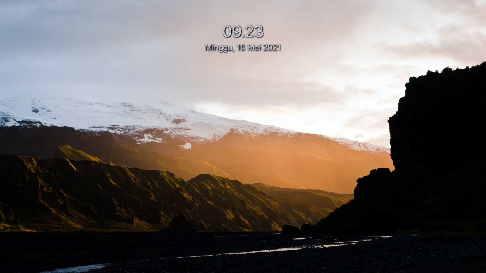
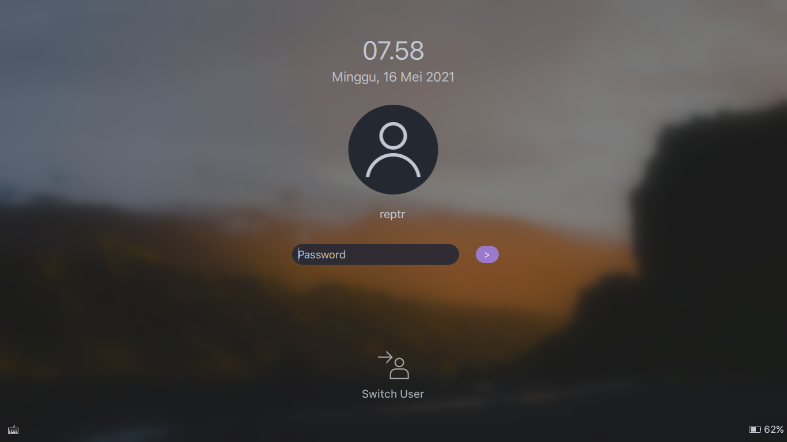
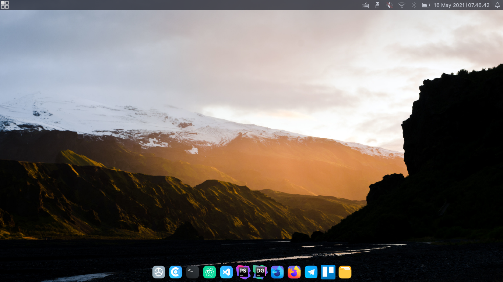
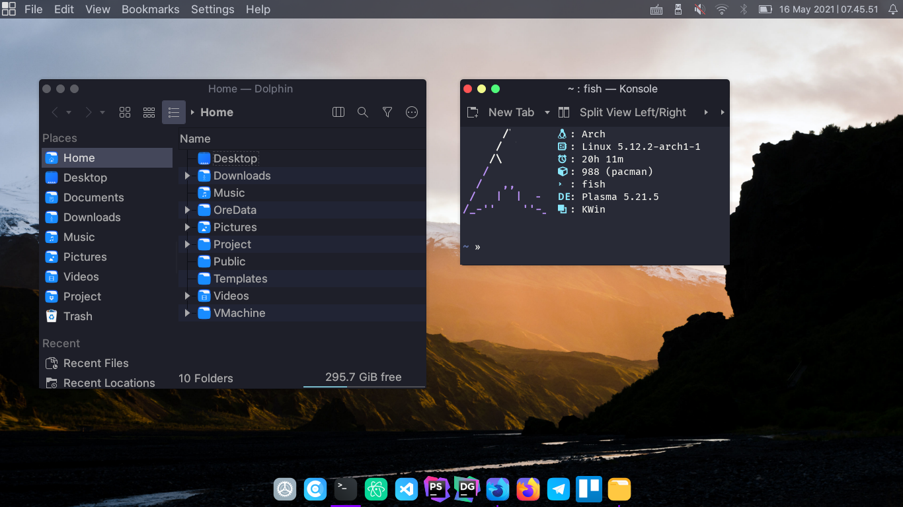

# ~/.dotfiles

## Table of Content

  - [About](#about)
  - [Information](#information)
  - [Screenshoot](#screenshoot)

## About
Hi there! Thanks for visiting!
 
This is my personal configuration for customization kde and some applications too.

I hope you understand everything here. :wink:

 

## Information

| #        | Details                                             |
| :------- | :-------------------------------------------------- |
| OS       | [Arch Linux](https://archlinux.org/)                |
| DE       | [KDE-Plasma](https://wiki.archlinux.org/title/KDE)  |
| WM       | KWin                                                |
| Shell    | [fish](https://github.com/fish)                     |
| Font     | SF Pro Display                                      |
| Terminal | [Konsole](https://wiki.archlinux.org/title/Konsole) |
| Dock     | [Latte-Dock ](https://github.com/KDE/latte-dock)    |
| Theme    | [Dracula](https://store.kde.org/p/1378924/)         |

 

## Screenshoot
### KDE-Plasma

* Lock Screen

* Lock Screen (login)

* Homescreen

* Dolphin & Neofetch

